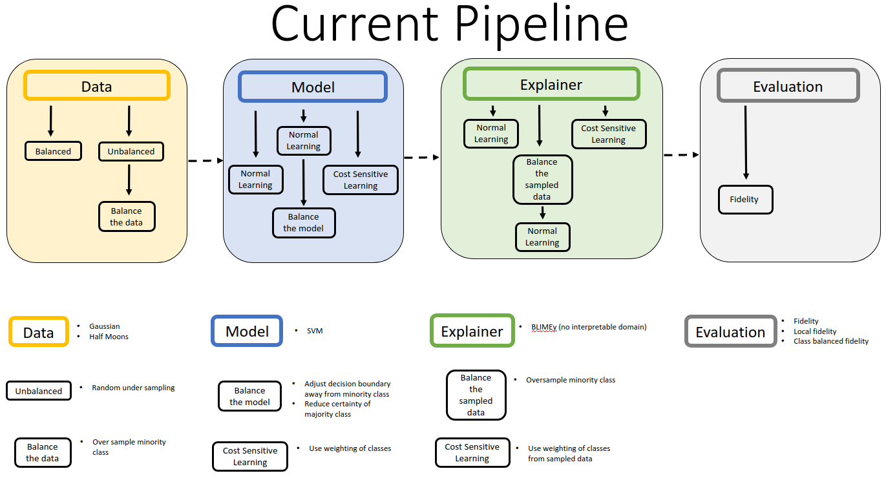

# CLIME — Class-balanced Local Interpretable Model-agnostic Explainer

A research testbed for local surrogate explainers (LIME / bLIMEy), investigating how the
**objective a surrogate model is trained on** relates to the **objective it is evaluated
against** — and how that relationship changes with where the query point sits on the
black box's decision surface.



Every stage of the pipeline — dataset, black box model, explainer, evaluation metric,
and the locations explainers are built at — is swappable by string key, so combinations
can be swept and compared.

## Paper

> Matt Clifford, Jonathan Erskine, Alexander Hepburn, Peter Flach, Raúl Santos-Rodríguez.
> **Reconciling Training and Evaluation Objectives in Location Agnostic Surrogate
> Explainers.** CIKM '23, pp. 3833–3837.
> [10.1145/3583780.3615284](https://doi.org/10.1145/3583780.3615284)

Headline result: the fidelity of a standard LIME explainer **degrades as the query point
moves away from the decision boundary** into low-density regions of the test set — the
high-confidence regions users trust most. The cause is a mismatch between the locally
sampled data the surrogate is trained on and the test data it is scored against.
Weighting the surrogate's training samples by the class imbalance in the *black box's own
predictions* re-aligns the two and recovers most of the lost fidelity, without needing
access to the test distribution.

Source: `~/Repos/Overleaf/CIKM-2023-camera-ready`. Figures reproduced by
`experiments/lime_vs_clime-sampling.py` and `experiments/gaussian_lime_vs_clime.py`.

## Documentation

| file | contents |
|---|---|
| [FINDINGS.md](FINDINGS.md) | **Start here.** Research state, results, open threads, verified bugs, suggested next experiments |
| [CLAUDE.md](CLAUDE.md) | Repo orientation and conventions |
| [clime/readme.md](clime/readme.md) | Package structure |
| [clime/pipeline/README.md](clime/pipeline/README.md) | The `opts` dict, running and sweeping configurations |
| [clime/data/README.md](clime/data/README.md) | Data format, available datasets, weighting utilities |
| [clime/models/readme.md](clime/models/readme.md) | Black box model and model-balancer interfaces |
| [clime/explainer/README.md](clime/explainer/README.md) | bLIMEy variants and the explainer interface |
| [clime/evaluation/README.md](clime/evaluation/README.md) | Metrics and evaluation runners |

## Setup

```bash
conda create -n clime python=3.9 -y
conda activate clime
pip install -e .
```

The Colab badge below is commented out: it installs from GitHub, and the packaging fix
(`FINDINGS.md` B1) is in the working tree but not yet pushed. Re-enable it once it is.

Do not upgrade scikit-learn past the pinned `1.1.3`; there is an unresolved
incompatibility with 1.2.2.

<!-- Broken until FINDINGS.md B1 is fixed:
Try out quickly in Colab: [](https://colab.research.google.com/github/mattclifford1/CLIME/blob/main/experiments.ipynb)
-->

## Running the pipeline

Interactively, via widgets — pick options, click **RUN PIPELINE**:

```bash
jupyter-notebook experiments.ipynb
```

Selecting several models / explainers / metrics runs every permutation and plots one
subplot per combination.

Programmatically:

```python
import clime

opts = {
    'dataset':             'Breast Cancer',
    'data params':         {'class_samples': [200, 200], 'percent_of_data': 0.05},
    'standardise data':    True,
    'dataset rebalancing': 'none',
    'model':               'Random Forest',
    'model balancer':      'none',
    'explainer':           'bLIMEy (cost sensitive sampled)',
    'evaluation metric':   'fidelity (local)',
    'evaluation points':   'between_class_means',
    'evaluation data':     'test data',
}

result = clime.pipeline.run_pipeline(opts, parallel_eval=True)
print(result['score']['avg'], result['score']['scores'])
```

See [clime/pipeline/README.md](clime/pipeline/README.md) for every available option and
for sweeping over several at once.

## Dev tools

```bash
pytest    # ~10 min: sweeps every pipeline module, plus numerical regression tests
```

`test_pipeline.py` checks that every configuration *completes*; the `test_costs.py`,
`test_metrics.py`, `test_utils.py` and `test_explanations.py` suites assert actual
values, and cover the bugs recorded in `FINDINGS.md` §6.

## Package structure

Available methods for each pipeline stage are declared in the `__init__.py` of each
subfolder — add new methods there and they are picked up automatically by the notebook
widgets, the permutation sweeper and the tests.

The pipeline itself is [make_pipeline.py](clime/pipeline/make_pipeline.py).
